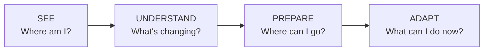
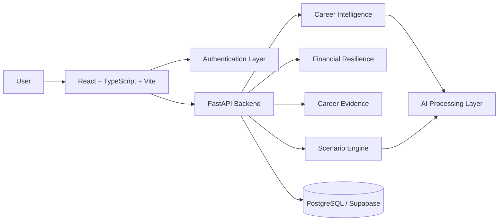

<div align="center">
  
  # JALUR B #
  ### A Vision of the Invisible ###

**Submission for ITECHNO CUP 2026 - Web Development**

**By [23:26, 8/1/2026] paldo bogor: Gile juga idenya**

</div>

---

## 📋 Daftar Isi

- [Tentang Proyek](#-tentang-proyek)
- [Fitur Unggulan](#-fitur-unggulan)
- [Demo & Screenshot](#-demo--screenshot)
- [Teknologi](#-teknologi)
- [Arsitektur Sistem](#-arsitektur-sistem)
- [Instalasi & Setup](#-instalasi--setup)
- [Penggunaan](#-penggunaan)
- [API Documentation](#-api-documentation)
- [Testing](#-testing)
- [Tim Developer](#-tim-developer)
- [Lisensi](#-lisensi)

---

## 👥 Tim Developer

| Nama                         | Peran              | GitHub                                         |
| ---------------------------- | ------------------ | ---------------------------------------------- |
| **Joan Orlando Purba**       | Frontend Developer | [@joanpurbaa](https://github.com/[joanpurbaa]) |
| **Revaldo Joe Atkins Bukit** | Backend Developer  | [@Grandepic1](https://github.com/[Grandepic1]) |
| **Keyla Namira Johan**       | Project Manager    | [@keylanami](https://github.com/[keylanami])   |

---

## 🎯 Tentang Proyek

### Latar Belakang

Dunia kerja tidak selalu berlabuh dengan suara keras, tetapi tak kalah besarnya pun berkelahi dengan faktor-faktor yang lepas dari tangkapan mata, harapan pada dinding atau gawainya, hingga sebuah algoritma berjalan di masing-masing genggaman.

Di Indonesia, jumlah pekerja yang tercatat terdampak Pemutusan Hubungan Kerja (PHK) dalam sistem Jaminan Kehilangan Pekerjaan (JKP) meningkat dari 57.261 pekerja pada 2024 menjadi 98.127 pekerja pada 2025. Data Kemnaker juga menunjukkan bahwa jumlah tersebut berfluktuasi dari bulan ke bulan, dengan tingkat yang lebih tinggi pada 2025 dibandingkan 2024. Angka ini merupakan pekerja yang tercatat dalam sistem klaim JKP dan bukan keseluruhan kasus PHK nasional, tetapi menunjukkan bahwa gangguan terhadap keberlangsungan pekerjaan dapat terjadi secara signifikan dan tidak selalu bergerak secara linear. [1]

Di saat yang sama, perubahan dunia kerja tidak hanya datang dari kondisi ekonomi. Artificial Intelligence (AI) mulai mengubah bagaimana pekerjaan dilakukan: sebagian tugas berpotensi diotomatisasi, sebagian lainnya mengalami transformasi melalui kolaborasi manusia–AI, sementara kebutuhan terhadap keterampilan baru ikut berkembang. ILO memperkirakan bahwa 21,7% pekerjaan di Indonesia memiliki tingkat paparan tertentu terhadap Generative AI, tetapi menegaskan bahwa AI exposure merupakan indikator potensi transformasi pekerjaan, bukan prediksi bahwa pekerjaan tersebut akan hilang. [2][3]

Sebuah pekerjaan dapat terlihat stabil hari ini bahkan ketika tuntutan di dalamnya telah berubah perlahan. Tugas-tugas rutin dapat semakin terotomatisasi, kebutuhan industri dapat bergerak ke arah baru, dan keterampilan yang sebelumnya cukup dapat kehilangan relevansinya. Karena itu, tantangannya bukan semata-mata “Apakah saya akan kehilangan pekerjaan?”, melainkan “Apakah saya mampu mengenali apa yang sedang berubah dan mempersiapkan langkah berikutnya sebelum perubahan tersebut menjadi krisis?”

Hal ini selaras dengan konsep employability yang memandang kesiapan menghadapi perubahan karier sebagai bentuk proactive adaptability, yang mencakup career identity, personal adaptability, serta social and human capital. [4] Penelitian mengenai career adaptability juga menunjukkan hubungan positif dengan proactive career behavior—perilaku seperti perencanaan karier, pengembangan keterampilan, eksplorasi peluang, dan tindakan aktif untuk membangun masa depan karier. [5]

Namun, kesiapan tersebut tidak selalu hadir sebelum perubahan terjadi. Hal ini sangat cukup untuk mendasari hadirnya Jalur B karena ancaman terhadap karier tidak selalu datang sebagai sesuatu yang terlihat. Kadang-kadang, ia ada terlebih dahulu sebagai perubahan kecil yang belum disadari.

### Solusi yang Ditawarkan

Jalur B adalah platform **career resilience** yang membantu pekerja memahami kondisi karier, melihat perubahan yang berpotensi memengaruhinya, dan mempersiapkan langkah berikutnya sebelum perubahan tersebut menjadi krisis.

Jalur B tidak meramalkan siapa yang akan di-PHK. Sebaliknya, Jalur B membantu pengguna **melihat yang belum terlihat** melalui:



| Tahap          | Fokus                                                          |
| -------------- | -------------------------------------------------------------- |
| **See**        | Memahami kondisi dan kerentanan karier saat ini.               |
| **Understand** | Melihat perubahan pekerjaan, AI exposure, dan relevansi skill. |
| **Prepare**    | Menemukan career pathway alternatif dan skill gap.             |
| **Adapt**      | Menjalankan skill mission dan membangun career evidence.       |

Dengan pendekatan tersebut, Jalur B menggeser career planning dari aktivitas yang bersifat reaktif menjadi pre-shock preparation: mempersiapkan pekerja ketika pilihan masih terbuka, bukan ketika pilihan sudah semakin sempit.

Dan lahirnya harapan Jalur B sebagai A Vision of the Invisible bukan untuk mengetahui masa depan dengan pasti, tetapi untuk membantu seseorang melihat kemungkinan yang belum terlihat serta mempersiapkan diri sebelum ia benar-benar membutuhkannya.

### Tujuan Proyek

- Membangun kesiapan karier pekerja dengan membantu mereka memahami kondisi, kerentanan, dan relevansi keterampilan yang dimiliki terhadap perubahan dunia kerja.
- Mendeteksi potensi perubahan pada pekerjaan melalui analisis konteks pekerjaan, aktivitas, keterampilan, dan AI exposure tanpa mengklaim sebagai prediksi PHK.
- Memperluas pilihan karier pengguna melalui pemetaan alternative career pathways dan identifikasi skill gap yang perlu dipenuhi.
- Mendorong persiapan karier yang proaktif dengan menerjemahkan hasil analisis menjadi misi pengembangan keterampilan dan pengumpulan bukti pengalaman secara berkelanjutan.
- Membantu pekerja mempertahankan employability dengan membangun kapasitas untuk beradaptasi terhadap perubahan, bukan sekadar merespons setelah kehilangan pekerjaan.

---

## ✨ Fitur Unggulan

### Fitur Utama

| Fitur                             | Deskripsi                                                                                                                                                             | Keunggulan                                                                                                                                       |
| --------------------------------- | --------------------------------------------------------------------------------------------------------------------------------------------------------------------- | ------------------------------------------------------------------------------------------------------------------------------------------------ |
| **Career Health Score**           | Menggambarkan kondisi kesiapan karier berdasarkan role, industri, pengalaman, tanggung jawab, perkembangan karier, dan bukti pengalaman.                              | Mengubah kondisi karier yang abstrak menjadi gambaran yang mudah dipahami dan menjadi titik awal persiapan.                                      |
| **Career Risk Scanner**           | Mengidentifikasi faktor yang dapat meningkatkan kerentanan karier berdasarkan pekerjaan, industri, skill dependency, dan perubahan di lingkungan kerja.               | Berfokus pada **vulnerability**, bukan klaim bahwa sistem dapat memprediksi siapa yang akan di-PHK.                                              |
| **AI Exposure + Skill Relevance** | Menganalisis aktivitas pekerjaan untuk melihat bagian yang berpotensi mengalami otomatisasi, transformasi, atau peningkatan kebutuhan human-AI collaboration.         | Mengikuti pendekatan task-oriented terhadap AI exposure sehingga AI tidak diposisikan secara simplistis sebagai “penghancur pekerjaan”.          |
| **Career Pivot Map**              | Memetakan role alternatif berdasarkan skill, pengalaman, tujuan karier, dan preferensi pengguna serta mengidentifikasi skill gap menuju role tersebut.                | Tidak hanya menjawab “skill apa yang kurang?”, tetapi juga **“ke mana saya bisa bergerak?”**                                                     |
| **Career Evidence Vault**         | Menyimpan project, achievement, feedback, certificate, training, award, dan bukti pengalaman kerja secara terstruktur.                                                | Mengubah pengalaman yang sering terlupakan menjadi **career evidence** yang dapat digunakan untuk membangun employability.                       |
| **Personal Runway**               | Menghitung kemampuan bertahan berdasarkan aset likuid dan kebutuhan pengeluaran esensial.                                                                             | Menambahkan dimensi finansial sehingga kesiapan karier tidak hanya dinilai dari skill, tetapi juga waktu yang tersedia untuk melakukan transisi. |
| **What If I Get Fired?**          | Mensimulasikan kondisi ketika pendapatan berhenti dan menggabungkan kesiapan karier, skill gap, career alternatives, serta financial runway menjadi rencana tindakan. | Mengubah skenario yang menakutkan menjadi **rencana konkret sebelum krisis benar-benar terjadi.**                                                |

### Fitur Tambahan

- **AI-Assisted CV Preview** - Mengekstraksi informasi dari CV untuk mempercepat onboarding, kemudian memberikan pengguna kesempatan untuk meninjau dan mengoreksi hasil sebelum dikonfirmasi.
- **Skill Mission** - Mengubah skill gap menjadi misi pengembangan yang dapat dikerjakan secara bertahap.
- **Career Evidence Attachment** - Mendukung lampiran dokumen atau artefak sebagai bukti pengalaman.
- **Scenario-Based Preparation** - Menghubungkan kondisi karier dan finansial pengguna untuk membentuk rencana persiapan yang lebih kontekstual.

---

## 📸 Demo & Screenshot

### Website

🔗 **[Kunjungi Website](https://jalur-b.vercel.app/)**

### Live Demo

🔗 **[Lihat Cara Pemakaian](https://youtu.be/MMvO5-eJv3w)**

### Screenshot Aplikasi

<div align="center">
  
  <p><em>Landing Page</em></p>

  
  <p><em>Beranda</em></p>

  
  <p><em>Kesehatan Karier</em></p>

  
  <p><em>Risiko Karier</em></p>

  
  <p><em>Skill</em></p>

  
  <p><em>Jalur Karier</em></p>

  
  <p><em>Bukti Karier</em></p>

  
  <p><em>Finansial</em></p>

  
  <p><em>Simulasi</em></p>

  
  <p><em>Profil</em></p>
</div>

---

## 🛠️ Teknologi

### Tech Stack

#### Frontend

```text
Framework          : React + TypeScript
Build Tool         : Vite
UI                 : Custom UI Components
State Management   : React State / Application State
Validation         : Frontend Form Validation
```

#### Backend

```text
Framework    : FastAPI
ORM          : SQLAlchemy 2 (Async)
Database     : PostgreSQL
Database API : asyncpg
Migration    : Alembic
Auth         : JWT + Google OAuth
Package Mgmt : uv
```

#### DevOps & Tools

```text
Frontend Deploy : Vercel
Backend         : Uvicorn / Python ASGI
Database        : Supabase PostgreSQL
Version Control : Git + GitHub
API Testing     : REST API / FastAPI OpenAPI
```

### Alasan Pemilihan Teknologi

| Teknologi                     | Alasan Pemilihan                                                                                                                                            |
| ----------------------------- | ----------------------------------------------------------------------------------------------------------------------------------------------------------- |
| **React + TypeScript + Vite** | Menyediakan pengembangan antarmuka yang modular, type-safe, cepat saat development, serta mendukung pengalaman pengguna yang responsif.                     |
| **FastAPI**                   | Cocok untuk membangun API yang ringan, terstruktur, dan performant. Automatic OpenAPI documentation juga mempermudah integrasi antara frontend dan backend. |
| **SQLAlchemy 2 Async**        | Menyediakan pemodelan database yang terstruktur sekaligus mendukung asynchronous database access untuk kebutuhan API modern.                                |
| **PostgreSQL**                | Dipilih untuk menyimpan data pengguna, career profile, skills, evidence, dan financial data secara konsisten menggunakan relational data model.             |
| **Alembic**                   | Menjaga perubahan schema database tetap terkontrol melalui migration yang dapat dilacak dan direproduksi.                                                   |
| **Supabase**                  | Menyediakan PostgreSQL yang siap digunakan sekaligus infrastruktur database yang praktis untuk deployment MVP.                                              |
| **uv**                        | Digunakan sebagai package manager Python yang cepat dan reproducible untuk environment backend.                                                             |
| **JWT + Google OAuth**        | Memberikan dua jalur autentikasi sekaligus menjaga access token tidak disisipkan pada OAuth redirect URL.                                                   |

### Dependencies Utama

#### Frontend

```json
{
  "dependencies": {
    "react": "...",
    "react-dom": "...",
    "typescript": "..."
  },
  "devDependencies": {
    "vite": "...",
    "typescript": "..."
  }
}
```

#### Backend

```text
fastapi
sqlalchemy
asyncpg
alembic
pydantic
uvicorn
```

> Versi dependency mengikuti lockfile dan package configuration yang digunakan pada repository.

---

## 🏗️ Arsitektur Sistem

### System Architecture



Jalur B menggunakan **frontend-backend separation**.

Frontend bertanggung jawab atas pengalaman interaksi pengguna, sedangkan backend menjadi pusat validasi, business logic, authentication, persistence, serta integrasi AI.

Pendekatan ini memungkinkan komponen analisis karier dan simulasi dikembangkan secara modular tanpa menempatkan business logic penting di sisi client.

### Database Schema

Source of truth database schema tersedia pada:

```text
jalurB-v2.erd
erd.md
```

Struktur database mendukung domain utama:

```text
User
 ├── Career Profile
 │    ├── Skills
 │    ├── Career History
 │    └── Career Evidence
 │
 └── Financial Profile
      ├── Liquid Assets
      ├── Essential Expenses
      └── Debt Obligations
```

Seluruh perubahan database dikelola melalui **Alembic migration** agar schema dapat dikembangkan tanpa kehilangan histori perubahan.

### Folder Structure

```text
jalur-b-fe/
├── src/
│   ├── components/      # Reusable UI components
│   ├── pages/            # Page-level components
│   ├── hooks/            # Reusable frontend logic
│   ├── services/         # API communication
│   └── ...
├── public/               # Static assets
├── tests/                # Test files
└── ...

jalur-b-be/
├── app/
│   ├── api/              # Route handlers per feature
│   ├── core/             # Settings, database engine & session
│   ├── models/           # SQLAlchemy ORM models
│   └── schemas/          # Pydantic schemas
├── alembic/              # Database migrations
├── main.py               # FastAPI application entrypoint
└── ...
```

---

## ⚙️ Instalasi & Setup

### Prerequisites

Pastikan Anda telah menginstall:

- **Node.js** (LTS recommended)
- **npm**
- **Python 3.11+**
- **uv**
- **PostgreSQL** atau akses ke **Supabase PostgreSQL**
- **Git**

### Langkah Instalasi

#### 1️⃣ Clone Repository

```bash
git clone https://github.com/joanpurbaa/-23-26-8-1-2026-paldo-bogor-Gile-juga-idenya
cd https://github.com/joanpurbaa/-23-26-8-1-2026-paldo-bogor-Gile-juga-idenya
```

#### 2️⃣ Install Frontend Dependencies

```bash
cd jalur-b-fe
npm install
```

#### 3️⃣ Install Backend Dependencies

```bash
cd jalur-b-be
uv sync
```

#### 4️⃣ Setup Environment Variables

Backend:

```bash
cp .env.example .env
```

Konfigurasi nilai yang diperlukan:

```env
DATABASE_URL="[postgresql_connection_string]"

JWT_SECRET_KEY="[your_unique_jwt_secret]"

FRONTEND_URL="[frontend_origin]"
BACKEND_URL="[backend_origin]"

CORS_ORIGINS="[allowed_frontend_origins]"

GOOGLE_CLIENT_ID="[google_client_id]"
GOOGLE_CLIENT_SECRET="[google_client_secret]"

SMTP_HOST="[smtp_host]"
SMTP_PORT="[smtp_port]"
SMTP_USER="[smtp_user]"
SMTP_PASSWORD="[smtp_password]"
```

> Jangan commit file `.env`, secret key, maupun OAuth credentials ke repository.

#### 5️⃣ Setup Database

```bash
cd jalur-b-be

uv run alembic upgrade head
```

#### 6️⃣ Run Backend

```bash
uv run uvicorn main:app --reload
```

Backend berjalan pada:

```text
http://localhost:8000
```

Health check:

```text
GET /health
```

#### 7️⃣ Run Frontend

```bash
cd jalur-b-fe

npm run dev
```

Frontend berjalan pada:

```text
http://localhost:5173
```

---

## 🚀 Penggunaan

### Menjalankan Aplikasi

#### Frontend

```bash
npm run dev
npm run build
npm run preview
```

#### Backend

```bash
uv run uvicorn main:app --reload
```

### User Guide

#### Untuk Pengguna Umum

1. **Registrasi / Login**
   Buat akun menggunakan email-password atau Google OAuth.

2. **Complete Career Profile**
   Masukkan role, industri, pengalaman kerja, aktivitas utama, tujuan karier, dan skill.

3. **See Your Career Condition**
   Gunakan Career Health Score untuk memahami kondisi kesiapan karier.

4. **Scan Career Vulnerability**
   Jalankan Career Risk Scanner untuk melihat faktor yang berpotensi meningkatkan kerentanan terhadap perubahan pekerjaan.

5. **Understand AI Exposure**
   Identifikasi aktivitas pekerjaan yang berpotensi mengalami otomatisasi atau transformasi serta skill yang perlu diperkuat.

6. **Explore Career Pivot**
   Temukan role alternatif yang sesuai dengan pengalaman dan skill pengguna.

7. **Build Career Evidence**
   Simpan project, achievement, certificate, feedback, dan artefak lainnya ke Career Evidence Vault.

8. **Prepare Before the Shock**
   Gunakan Personal Runway dan What If I Get Fired? untuk memahami kesiapan menghadapi penghentian pendapatan dan membentuk rencana tindakan.

#### Untuk Admin

Jalur B pada MVP berfokus pada pengalaman pengguna individual. Infrastruktur backend telah dipisahkan secara modular agar fungsi administrasi dapat dikembangkan tanpa mengubah core career-resilience workflow.

---

## 📚 API Documentation

### Base URL

```text
Development:
http://localhost:8000/api

Production:
https://jalur-b.fastapicloud.dev/docs#/
```

### Endpoints

#### Authentication

```http
POST /api/auth/register
POST /api/auth/login
GET  /api/auth/me
POST /api/auth/logout

GET  /api/auth/google/start
GET  /api/auth/google/callback
POST /api/auth/google/exchange
```

#### Onboarding

```http
GET /api/onboarding
PUT /api/onboarding
GET /api/onboarding/options
```

#### Profile

```http
GET   /api/profile
PATCH /api/profile
```

#### CV Preview

```http
POST /api/profile/cv/preview
POST /api/profile/cv/confirm
GET  /api/profile/cv
```

#### Skills

```http
GET /api/master/skills
```

#### Financial Resilience

```http
GET    /api/financial
PUT    /api/financial

POST   /api/financial/assets
PATCH  /api/financial/assets/{asset_id}
DELETE /api/financial/assets/{asset_id}
```

#### Career Evidence

```http
GET    /api/evidence
POST   /api/evidence
PATCH  /api/evidence/{evidence_id}
DELETE /api/evidence/{evidence_id}

POST   /api/evidence/{evidence_id}/attachment
DELETE /api/evidence/{evidence_id}/attachment
```

#### Dashboard

```http
GET /api/dashboard
```

### Example Request

```javascript
const response = await fetch("/api/auth/login", {
  method: "POST",
  headers: {
    "Content-Type": "application/json",
  },
  body: JSON.stringify({
    email: "user@example.com",
    password: "password123",
  }),
});

const data = await response.json();
```

📖 **[Dokumentasi API Lengkap](./docs/API.md)**

---

## 🧪 Testing

### Running Tests

#### Frontend

```bash
npm run lint
npm run build
```

#### Backend

```bash
uv run alembic upgrade head
uv run uvicorn main:app --reload
```

API endpoints dapat divalidasi melalui dokumentasi OpenAPI yang disediakan FastAPI.

### Validation Focus

Pengujian dan validasi Jalur B berfokus pada:

```text
✓ Authentication & authorization
✓ Input validation
✓ Database persistence
✓ Career profile integrity
✓ Financial calculation consistency
✓ Evidence ownership
✓ CV preview / confirmation flow
✓ API response validation
✓ CORS & OAuth configuration
```

Khusus untuk AI-generated information, sistem menerapkan prinsip:

> **AI may assist interpretation, but confirmed user data remains user-controlled.**

CV extraction menggunakan alur preview → review → confirmation sehingga hasil AI tidak langsung menimpa data pengguna tanpa validasi.

---

## 📄 Lisensi

Proyek ini dilisensikan di bawah [MIT License](LICENSE) - lihat file LICENSE untuk detail lebih lanjut.

---

<div align="center">

**Made with ❤️ by [23:26, 8/1/2026] paldo bogor: Gile juga idenya for ITECHNO CUP 2026**

_A Vision of the Invisible._
**See what is changing before it changes you.**

</div>

---

## Daftar Pustaka

**[1]** Kementerian Ketenagakerjaan Republik Indonesia. (2026). _Snapshot Statistik Ketenagakerjaan Nasional_. Satu Data Ketenagakerjaan.
https://satudata.kemnaker.go.id/

**[2]** International Labour Organization. (2026). _Generative AI and labour markets in ASEAN: Significant exposure, limited disruption, uneven preparedness_. ILO.
https://www.ilo.org/resource/news/ai-may-affect-nearly-80-million-workers-asean-region-large-scale-job

**[3]** Merola, R., Ernst, E., Samaan, D., del Rio-Chanona, M., & Teutloff, O. (2026). _Workers’ exposure to AI: What indicators tell us – and what they don’t_. International Labour Organization.
https://doi.org/10.54394/00033279

**[4]** Fugate, M., Kinicki, A. J., & Ashforth, B. E. (2004). Employability: A psycho-social construct, its dimensions, and applications. _Journal of Vocational Behavior, 65_(1), 14–38.
https://doi.org/10.1016/j.jvb.2003.10.005

**[5]** Peng, P., Song, Y., & Yu, G. (2021). Cultivating proactive career behavior: The role of career adaptability and job embeddedness. _Frontiers in Psychology, 12_, 603890.
https://doi.org/10.3389/fpsyg.2021.603890
