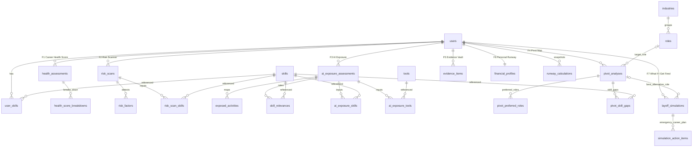

# Jalur B — Database ERD v2 (Normalized, 3NF)

Database: `jalurB` (MySQL). 25 tables, based on the **latest payloads from Google Docs** (supersedes plan.md).
Open **`jalurB-v2.erd`** in the erd-editor VS Code extension to view/edit visually.

## Design Principles

- **3NF**: master data separated (`roles`, `industries`, `skills`, `tools`); M:N via junctions.
- **Snapshot pattern**: every AI feature run stores an immutable assessment row (`*_at`) including its input payload fields (`wajib` = NOT NULL, `opsional` = nullable), matching the payload spec exactly.
- **Skills/tools as arrays → junction tables**: `risk_scan_skills`, `ai_exposure_skills`, `ai_exposure_tools` (no comma-separated columns).
- **What If I Get Fired consumes existing data**: no new inputs; reads career/financial/backup data and writes scores + emergency plan.

## Mermaid ERD

## Feature → Tables Mapping (per latest payload)

### F1 Career Health Score → `health_assessments` + `health_score_breakdowns`
Inputs: role, industry, work_duration, responsibilities (wajib); achievements, performance_feedback (+file URL), career_progression (opsional). Output: overall_score, level.

### F2 Career Risk Scanner → `risk_scans` + `risk_factors` + `risk_scan_skills`
Inputs: role, industry, responsibilities, skills[] (via junction). Outputs: per-source factors (industry_shift / market_demand / role_change / skill_dependency / ai_advancement) + severity.

### F3 AI Exposure + Skill Relevance → `ai_exposure_assessments` + `exposed_activities` + `skill_relevances` + `ai_exposure_skills` + `ai_exposure_tools`
New vs v1: `tools_and_methods[]` stored via `tools` master + `ai_exposure_tools`; work_experience column.

### F4 Career Pivot Map → `pivot_analyses` + `pivot_preferred_roles` + `pivot_skill_gaps`
New vs v1: current_role, industry, work_experience (wajib); preferred_roles[] normalized into own table; work_preferences text.

### F5 Career Evidence Vault → `evidence_items`
Per payload: evidence_type enum (project/achievement/feedback/certificate/award/training/other), title, user_role, description, impact (all wajib), date + private attachment opsional. Tags table removed (not in payload).

### F6 Personal Runway → `financial_profiles` (1:1) + `runway_calculations`
Payload fields only: available_savings, monthly_essential_expenses (wajib); monthly_debt_payment, dependents, other_liquid_funds (opsional). No income/target columns anymore.
`financial_runway_months = (savings + liquid funds) / (expenses + debt)`.

### F7 What If I Get Fired → `layoff_simulations` + `simulation_action_items`
Consumes data from all previous features. Outputs: career_readiness_score, financial_readiness_score, overall_resilience_score, financial_runway_months, financial_gap, estimated_preparation_time_months, best_pivot_analysis_id (best_alternative_roles) → emergency_career_plan steps in `simulation_action_items`.

## Referential Integrity

- All child FKs: `ON DELETE CASCADE`.
- `layoff_simulations.best_pivot_analysis_id`: nullable, `SET NULL` on delete.
- `financial_profiles.user_id`: UNIQUE (1:1).
- `user_skills(user_id, skill_id)`: UNIQUE composite index `uq_user_skill`.

## Notes

- Old files kept for reference: `database.erd`, `jalurB-full.erd` (v1 schema). Use **`jalurB-v2.erd`** going forward.
